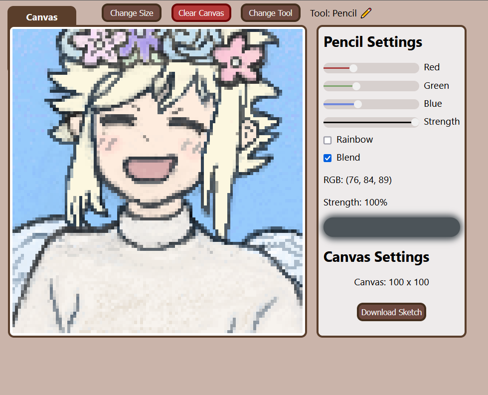
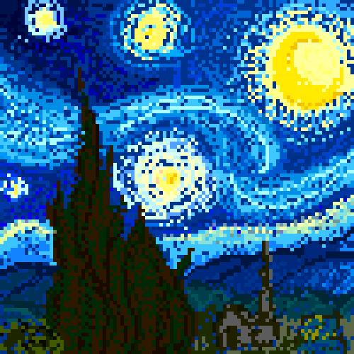

# :pencil2: Etch-a-Sketch :art:

    

## Table of Contents
- [About](#about)
- [Installation / Website Demo](#installation--website-demo)
- [Features](#features)
  * [Pencil Settings](#pencil-settings)
  - [Top Settings](#top-settings)
    * [Change Size](#change-size)
    * [Clear Canvas](#clear-canvas)
    * [Change Tool](#change-tool)
    * [Download Sketch](#download-sketch)
- [Gallery](#gallery)
- [Credit](#credit)

## About
This Etch-a-Sketch project is the first web-dev project I've created outside of an academic setting, combining self-taught HTML/CSS/JavaScript knowledge over the course of a few weeks. The project is a fleshed out canvas tool, offering various features of user funcitonality to provide precise means of painting beautiful images.

## Installation / Website Demo
The website demo was hosted using Vercel, and can be accessed below:

[Etch-a-Sketch](https://etch-a-sketch-ten-inky.vercel.app)

Otherwise, the project's functionality can be tested through the following steps:
1. Download the repository.
2. Extract the repository.
3. Locate index.html within the repository, and drag it into a URL of your choosing.

## Features
The etch-a-sketch includes several features intended to enhance the precision with which users can paint the canvas, some of which are to make the experience chaotically amusing, and to facilitate creativity, and the others providing practical means of manipulating the canvas.

#### Pencil Settings
The board is painted by clicking, and dragging across the tiles of the board. The sliders on the right of the canvas offer precise control over the RGB value of user streak, and streak opacity (strength). Clicking the streak display will open a rainbow gradient for choosing streak colors.

The rainbow feature selects a random RGB value to paint each grid on the canvas, while the blend feature sets the grid to the midpoint between two RGB values.

 [!NOTE]
 If the RGB differs with blend mode activated, the opacity of the tile will compound with the current tool opacity. If blend mode is inactivated, a different RGB will reset opacity to that of the current tool strength.

### Top Settings
 

#### Change Size
"Change Size" can be used to set the number of tiles in one dimension of the grid (between 1 and 150). The total number of tiles in the grid is the value of this size squared.

#### Clear Canvas
Clicking "Clear Canvas" resets the board to its initial state, removing all current drawings on the board.

#### Change Tool
Clicking the "Change Tool" button allows the user to switch between several tools:
* **Pencil**: Makes single solitary strokes on the canvas as the left mouse button is clicked and dragged.
* **Eraser**: Softens the strokes on the canvas using the current strength value selected in pencil settings.
* **Fill**: Colors a region of adjacent tiles with the same RGB value to the new RGB value as selected in pencil settings.
* **Match**: Clicking a tile will set the RGB, and strength value in pencil settings to that of the tile that was clicked. Automatically transitions the user to the pencil tool upon left mouse button click.

#### Download Sketch

Clicking the "Download Sketch" button saves the current drawing, and downloads it to your computer as a .png representation.

[!NOTE]
Keep in mind that strokes with an opacity less than 100% may exhibit dimming, since the transparency results in a different appearance on the website compared to the .png file.

## Gallery

    
    
    
    
    

## Credit
Sound effects used in the etch-a-sketch were provided from the royalty-free sound effect archive of [Pixabay](https://pixabay.com/)

### Enjoy! :white_check_mark:
[Back to Top](#table-of-contents)

